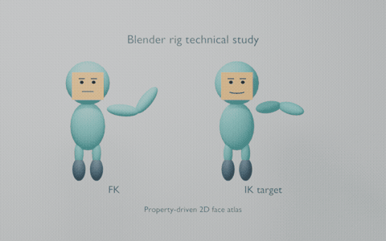

# Selected work

## Desktop Reptiles — released game

[View Desktop Reptiles on Steam](https://store.steampowered.com/app/4699700/Desktop_Reptiles/)

I am the solo developer of Desktop Reptiles, a 3D desktop reptile-care game built in Godot. I handled its full-stack development. The game was released on Steam in July 2026 under Lacuna Works.

## Independent work demonstrations

[Open the browser demonstrations](https://ariyachan.github.io/freelance-work-samples/)

- [Nested memory vector study](nested-memory-vector-demo.svg) — original SVG illustration demonstrating a phone-within-phone zoom concept; independent portfolio exercise, not client work.
- [Evening conversation interface](https://ariyachan.github.io/freelance-work-samples/evening/) — responsive layout, theme switching and preset interactions.
- [Northline treasury interface](https://ariyachan.github.io/freelance-work-samples/treasury/) — responsive fintech dashboard concept with sample charts, searchable transactions and CSV export. All financial data is fictional; no live account connection.
- [Autonomous arena](https://ariyachan.github.io/freelance-work-samples/arena/Autonomous-arena-demonstration.html) — JavaScript simulation with match controls.
- [Manufacturing workflow](https://gist.github.com/Ariyachan/0fe95a1fd96227874a37398c867531ff) — n8n validation and reporting example using synthetic records.
- [Four-player paper puzzle](puzzles/four-hands.md) — specification and worked solution; not playtested.

These are independent project demonstrations, not paid client projects. Kai Zhang / Ariyachan.

## Technical writing

- [The Firestore document had an ID. The model still rejected it.](articles/firestore-document-id-model-boundary.md) — an AI-assisted field note grounded in a public code contribution and its recorded tests; it does not claim client publication or upstream acceptance.

## Blender character rig — technical study

[Watch or download the four-second MP4](samples/blender-rig-study/rig-technical-study.mp4)

A self-initiated study using original, simple segmented characters. It demonstrates weighted FK/IK movement and bone-property-driven facial texture states. Pose, skin movement and four facial states were checked, including after saving and reopening in Blender 4.5.9.

This is a small technical study, not a commissioned character or a production-ready rig. It does not establish organic deformation quality, seamless IK/FK pose matching, or acceptance against a buyer's models. Model topology, facial requirements, controls and acceptance would be agreed before paid production.

## Vertical type-guessing video

[Download the 12-second MP4](https://raw.githubusercontent.com/Ariyachan/freelance-work-samples/main/Quiz-video-demonstration.mp4)

A self-initiated demonstration of a reusable text-based guessing-video layout: question, three choices, 3–2–1 countdown and answer reveal. Created by Ariyachan as a work sample, not a prior client project or commissioned delivery.

- H.264 MP4, 720 × 1280, 30 fps, 12 seconds.
- Silent demonstration; no voiceover, music or supplied buyer assets.
- Question and answer frames were visually checked; video metadata was verified with ffprobe.
- Typography and layout were created for this sample. Pokémon and Pikachu are third-party names; this is an unofficial fan trivia example.

The final content, duration, audio, branding and delivery format would be agreed against a buyer's reference before paid production.
